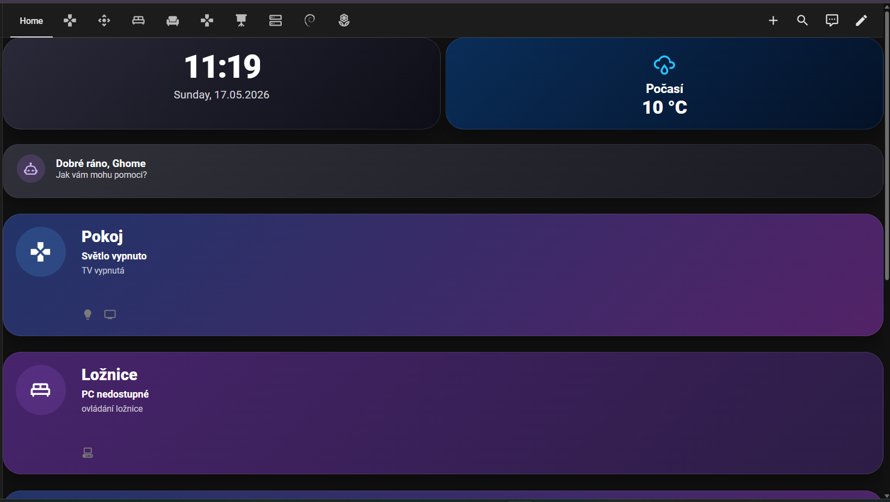

# Smart Home Project

Custom smart home ecosystem built with Home Assistant, ESPHome and AI integrations.

## Overview

This project is my personal smart home system focused on:
- modern dashboard design
- automation
- AI integrations
- room control
- monitoring
- self-hosting

Built and maintained as a real-world homelab and smart home environment.

---

## Features

- Dynamic room dashboards
- Smart lighting control
- TV integrations
- ESPHome devices
- AI assistant integrations
- Server monitoring
- Energy monitoring
- Responsive mobile UI
- Custom button-card layouts
- Real-time device states

---

## Technologies

- Home Assistant
- ESPHome
- MQTT
- Docker
- Linux
- Node-RED
- OpenAI
- Custom Button Card

---

## Dashboard Preview



---

## Dashboard Configs

### Room Card
- Dynamic TV status
- Smart light states
- Custom gradients
- Responsive layout

### Cinema Card
- Server temperature monitoring
- CPU monitoring
- Media room controls

### Living Room Card
- Multi-light control
- TV integration
- Smart socket states

---

## Repository Structure

```txt
screenshots/
dashboards/
automations/
esphome/
docs/
