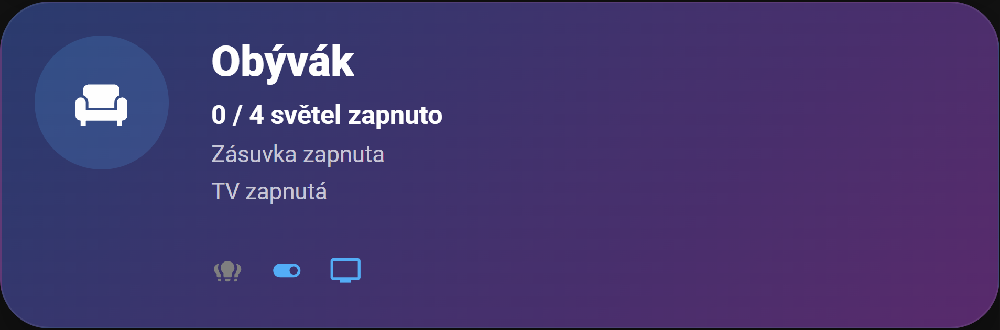
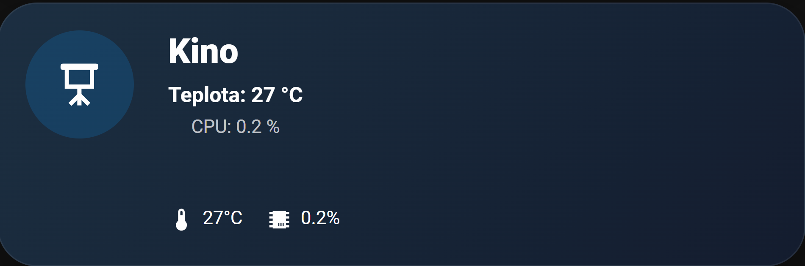

# Smart Home Project

Custom smart home ecosystem built with Home Assistant, ESPHome and AI integrations.

This repository contains my personal smart home setup focused on:
- modern dashboard design
- automation
- AI integrations
- server monitoring
- self-hosting
- smart room control

---

# Preview

## Room Dashboard


Gaming room dashboard with:
- smart lighting
- TV control
- sleep automation
- custom UI
- responsive layout

---

## Living Room Dashboard



Living room dashboard featuring:
- multi-light control
- smart sockets
- TV integration
- dynamic device states

---

## Cinema Dashboard



Cinema/media dashboard with:
- server monitoring
- CPU temperature monitoring
- media controls
- homelab integration

---

# Features

- Dynamic room dashboards
- Smart lighting automation
- TV/media integrations
- ESPHome devices
- MQTT integrations
- AI assistant integrations
- Energy monitoring
- Server monitoring
- Responsive mobile UI
- Custom button-card layouts
- Real-time device states

---

# Technologies

- Home Assistant
- ESPHome
- MQTT
- Docker
- Linux
- Node-RED
- OpenAI
- Zigbee2MQTT
- Custom Button Card

---

# Repository Structure

```txt
dashboards/
├── room/
│   ├── room-card.yaml
│   └── room.png
│
├── living-room/
│   ├── living-room-card.yaml
│   └── living-room.png
│
└── cinema/
    ├── cinema-card.yaml
    └── cinema.png

automations/
esphome/
docs/
```

---

# Dashboard Architecture

```txt
Home Assistant
├── MQTT
├── ESPHome
├── Zigbee2MQTT
├── AI integrations
├── Media control
├── Smart lighting
└── Server monitoring
```

---

# Dashboard Examples

## Room Card
- Dynamic TV status
- Smart lighting states
- Gradient UI
- Gaming room layout

## Living Room Card
- Multi-device monitoring
- Smart sockets
- Media integration
- Dynamic status updates

## Cinema Card
- CPU monitoring
- Temperature monitoring
- Media room controls
- Homelab overview

---

# Goals

The goal of this project is to build a modern smart home ecosystem combining:
- automation
- AI
- monitoring
- self-hosting
- UI/UX design

while continuously improving my technical and frontend skills.

---

# Future Plans

- AI voice assistant
- Better automation system
- Presence detection improvements
- Advanced mobile dashboards
- Energy optimization
- More ESPHome devices
- Smart notifications
- Interactive dashboard animations

---

# About

This project is actively developed and continuously improved as part of my personal smart home and homelab environment.
